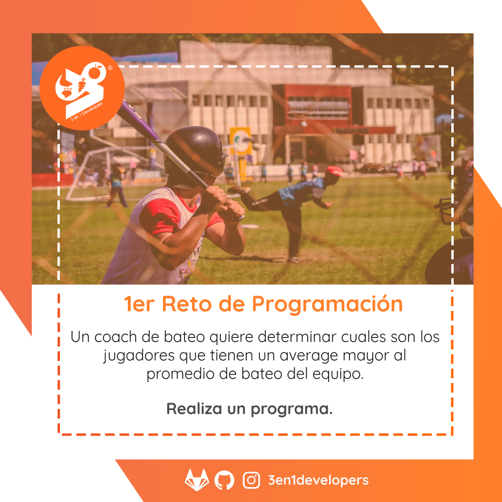
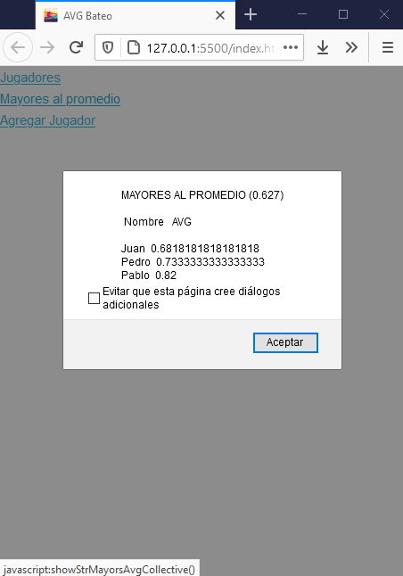
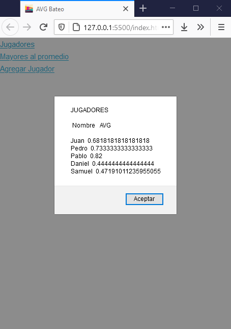

# AVG Bateo

## 1er Reto de Programación



Un coach de bateo quiere determinar cuales son los jugadores que tienen un average mayor al promedio de bateo del equipo.

**Realiza un programa.**

## Características ❤️

* Determinar jugadores con averages mayores al promedio colectivo.
* Calcular promedio de bateo colectivo.
* Calcular average individual.
* Agregar jugador

## Pendientes

* Seleccionar y editar datos de un jugador.
* Eliminar un jugador.
* Agregar un backend API Rest que permita la persistencia de los datos de los jugadores.
* Maquetar un formulario de registro de jugador.
* Maquetar una tabla los jugadores mayores al promedio de bateo colectivo.
* Maquetar una tabla con todos los jugadores.

## Galería 📖




*Capturas de pantallas (02-05-2021)*

## Ejecución 🚀

Para poner en funcionamiento el código del proyecto basta con descargar o clonar el proyecto y abrir el achivo [index.html](./index.html).

## Herramientas 🛠️

* HTML v5 - Lenguaje de etiquetas para estructurar las páginas web.
* CSS - Lenguaje de hoja de estilos.
* Skeleton v2.0.4- Microframework de CSS
* JavaScript  (EmacScript 6) - Lenguaje de programación por excelencia para la Web.
* Node.js v14.16.1 - Entorno de ejecución de Javascript del lado del servidor.
* Jest v26.6.3 - Herramientas de pruebas automatizadas

### Instalación 🔧

A continuación les dejamos el paso a paso de la instalación de las herramientas necesario para el ambiente de desarrollo:

#### Paso 1. Instalar node.js

Para ello puedes acceder al sitio oficial de Node.js y descargar el instalador.

#### Paso 2. Instalar dependencias del proyecto

```
npm install
```
#### Paso 3. Ejecutar las pruebas

```
npm run test
```

## Créditos

### Autores ✒️

* **Achique Luis** - *Software Developer* - [achique-luisdan](https://gitlab.com/achique-luisdan)

También puedes mirar la lista de todos los [contribuyentes](https://gitlab.com/3en1developers/avg-bateo/contributors) quíenes han participado en este proyecto. 

### Recursos 📄

#### Ilustración del reto: 

Lino Khim Medrina en <a href="https://www.pexels.com/photo/people-playing-baseball-1234953/">Pexels</a>

#### Avatar del repositorio:  
Illustratelife Vector en <a href="https://www.vecteezy.com/free-vector/vector">Vecteezy</a>